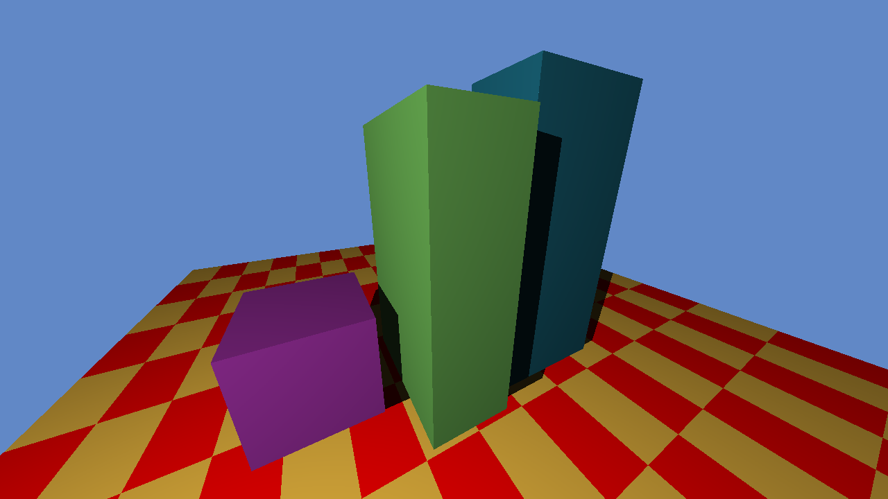

# Bare Ray Tracer

A simple ray tracer written in C++ to learn basic graphics related concepts. You can download the binaries from the [release tab](https://github.com/antjowie/Bare-Ray-Tracer/releases).

## Quick overview of the repository
Here are all the folders and their purpose
- dependencies  
  Contains all libs that I use (only SFML for graphics)
- docs  
  Contains all my research/evidence with pictures, logs and diagrams.
- projects  
  Contains the code for the project. Just open the .sln file with VS2017.
- references  
  Contains the reference images that I tried to recreate.
- resources  
  Contains configuration files for the project, these are copied over when building for easy distribution.

Showcasing the BVH speed

# How to use the ray tracer?
Upon launch, look at the command prompt, it explains all the controls that you need to know about. The following text is about how to modify the ray tracer and add your own scenes.

## What can I modify in resources?
I didn't want to recompile my project everytime when I changed a scene, so I decided to use json for all my configurations. This is because I find JSON easy to modify and it has plenty of parsers.  
Resources folder contains all of these files. 

### Config.json
- fps: The fps cap
- imageXXX: The size of the render target. This can be lowered when prototyping. It is best if it reflects the windowXXX.
- windowXXX: The size of the window.
- maxRenderTime: The amount in seconds after the window should be updated with the current rendered frame. This allows the user to see the ray tracer progress, as it is quite slow.

### Scene.json
When loading a scene, you select the corresponsding number on the numpad. Modifying a scene and adding a scene is thus very simple. If you want to see the options for surfaces, you can look at the [Application.cpp](projects/Application/source/Application.cpp) constructor. The surface types are defined here. The [constructFunctions.cpp](projects/Application/constructFunctions.cpp) defines what data is loaded.

